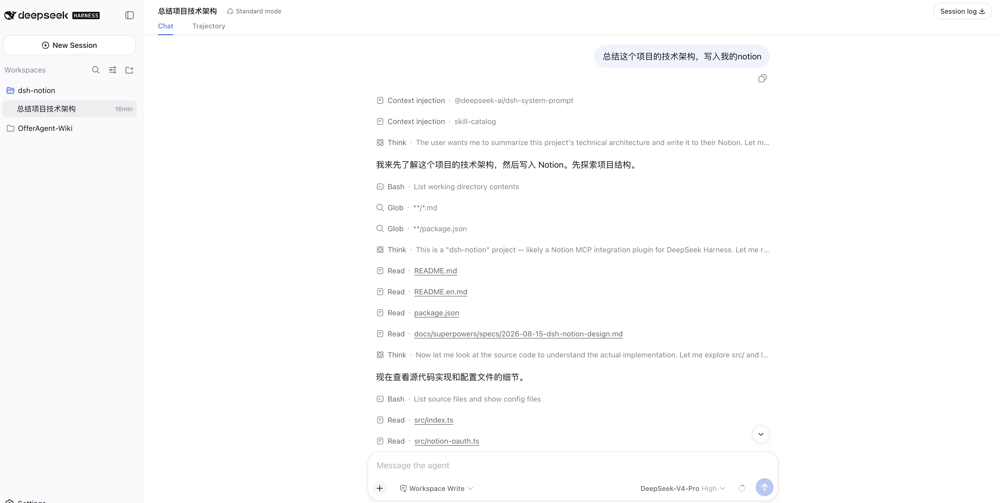
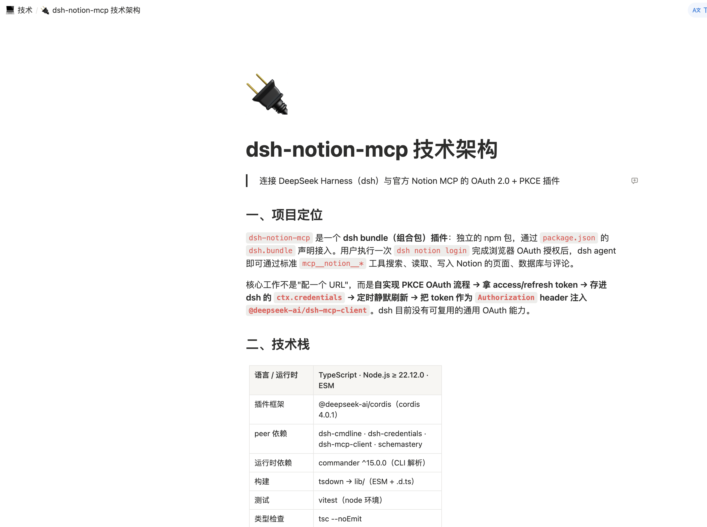

# dsh-notion-mcp

Connect [DeepSeek Harness](https://github.com/deepseek-ai/dsh) (`dsh`) to [Notion](https://www.notion.com) through the official Notion MCP server, using OAuth 2.0 (authorization code + PKCE). After a one-time browser authorization, your `dsh` agent can search, read, and write Notion pages, databases, and comments through the standard `mcp__notion__*` tools.

[](LICENSE) [](https://nodejs.org)

[中文](README.md) | English

## What it does for you

Once installed, your `dsh` agent can read and write Notion directly. You authorize once in your browser, and the plugin takes care of everything after that: it runs the full OAuth 2.0 (authorization code + PKCE) flow, stores the tokens securely in dsh's credential seam, refreshes them silently in the background, and mounts Notion's search, page, database, and comment tools under `mcp__notion__*`.

## Features

- **Zero-config OAuth** — dynamic client registration (RFC 7591) registers a client at runtime; no `client_id` or secret to copy.
- **One-time browser login** — `dsh notion login` prints an authorization URL and waits for the callback on `127.0.0.1:53007`.
- **Silent token refresh** — access tokens (~8 h) refresh automatically before expiry; the rotated refresh token is persisted atomically.
- **Terminal `invalid_grant` handling** — an expired or rotated-away refresh token is never retried; the plugin clears it and asks you to re-authorize.
- **No secrets in the repo** — tokens live in dsh's credential store, not in this repository.

## Screenshots

Ask the `dsh` agent to summarize a technical architecture and write it into Notion:



The resulting Notion page:



## How it works

```text
dsh notion login
   │  1. OAuth discovery (RFC 9470 / RFC 8414)
   │  2. Dynamic client registration (RFC 7591)
   │  3. PKCE S256 + state → authorization URL
   ▼
browser approves → callback on 127.0.0.1:53007
   │  4. Exchange code (plus PKCE verifier) for tokens
   ▼
tokens persisted → Notion MCP mounted as mcp__notion__*
```

On startup the plugin loads the stored tokens and mounts the MCP client; as they near expiry it refreshes them in the background (serialized, so a rotated refresh token is never replayed concurrently).

## Install

```sh
dsh plugin --profile web add dsh-notion-mcp
```

Replace `web` with whichever profile you run the agent in (`web`, `headless`, `tui`, …).

## Authorize

The `notion` command runs in a minimal profile — a UI app such as `web` owns its own command line and does not forward `notion` to the plugin. Tokens are stored globally, so authorize once from a minimal profile and every profile that has the plugin installed picks it up:

```sh
dsh plugin --profile notion add dsh-notion-mcp
dsh --profile notion notion login
```

The command registers a dynamic OAuth client, starts a temporary local HTTP server on `127.0.0.1:53007`, and prints an authorization URL. Open it in your browser and approve the request; Notion redirects to `http://127.0.0.1:53007/callback`, and the plugin validates the `state`, exchanges the code (plus the PKCE verifier) for tokens, stores them, and mounts the client.

After authorization, Notion tools are available under `mcp__notion__*`.

## Uninstall

```sh
dsh plugin --profile web remove dsh-notion-mcp
```

## Configuration

| Key | Default | Description |
| --- | --- | --- |
| `mcpUrl` | `https://mcp.notion.com/mcp` | Notion MCP server URL |
| `port` | `53007` | Local OAuth callback port (`127.0.0.1`) |

## Security

- Tokens are stored through dsh's credential seam (`ctx.credentials`) as a single atomic entry and are never committed to this repository. No `client_id` or secret is embedded — the client is registered at runtime via dynamic client registration.
- Notion rotates the refresh token on every refresh; the new token is persisted atomically together with the access token.
- If Notion returns `invalid_grant` (refresh token expired or rotated away), the plugin clears the stored tokens and stops retrying — re-authorize with `dsh notion login`.

## Requirements

- [DeepSeek Harness](https://github.com/deepseek-ai/dsh) (`dsh`)
- Node.js ≥ 22.12.0

## Development

```sh
npm install
npm run build      # tsdown → lib/
npm run typecheck  # tsc --noEmit
npm test           # vitest
```

## License

[MIT](LICENSE) © 2026 mingzeng
