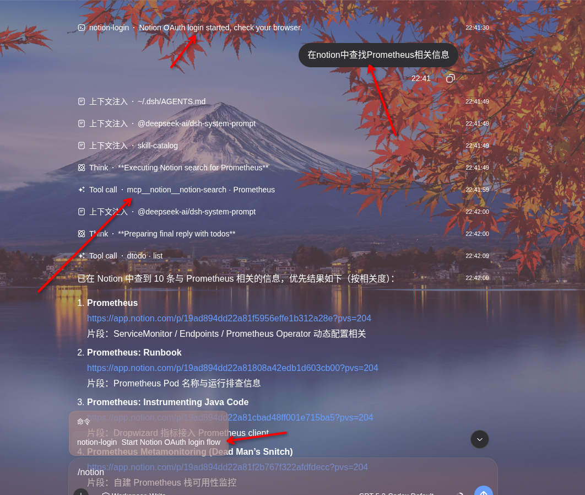

# dsh-notion-mcp

Connect [DeepSeek Harness](https://github.com/deepseek-ai/dsh) (`dsh`) to [Notion](https://www.notion.com) through the official Notion MCP server, using OAuth 2.0 (authorization code + PKCE). After a one-time browser authorization, your `dsh` agent can search, read, and write Notion pages, databases, and comments through the standard `mcp__notion__*` tools.

[](LICENSE) [](https://nodejs.org) [](https://awesome-dsh-plugin.com)

[中文](README.md) | English

## What it does for you

Once installed, your `dsh` agent can read and write Notion directly. You authorize once in your browser, and the plugin takes care of everything after that: it runs the full OAuth 2.0 (authorization code + PKCE) flow, stores the tokens securely in dsh's credential seam, refreshes them silently in the background, and mounts Notion's search, page, database, and comment tools under `mcp__notion__*`.

## Features

- **Zero-config OAuth** — dynamic client registration (RFC 7591) registers a client at runtime; no `client_id` or secret to copy.
- **One-time browser login** — two entry points are supported: `dsh notion login` (CLI) or call `/notion-login` directly in the chat dialog.
- **Automatic external browser launch** — the login flow prints the authorization URL and also tries to open your system browser automatically on `127.0.0.1:53007`; if that fails, open the URL manually.
- **Silent token refresh** — access tokens (~8 h) refresh automatically before expiry; the rotated refresh token is persisted atomically.
- **Terminal `invalid_grant` handling** — an expired or rotated-away refresh token is never retried; the plugin clears it and asks you to re-authorize.
- **No secrets in the repo** — tokens live in dsh's credential store, not in this repository.

## Screenshots

Ask the `dsh` agent to summarize a technical architecture and write it into Notion:


The resulting Notion page:


Method B



## How it works

```text
Entry A: dsh notion login
Entry B: call /notion-login in the chat dialog
   │  1. OAuth discovery (RFC 9470 / RFC 8414)
   │  2. Dynamic client registration (RFC 7591)
   │  3. PKCE S256 + state → authorization URL (and try to open external browser)
   ▼
browser approves → callback on 127.0.0.1:53007
   │  4. Exchange code (plus PKCE verifier) for tokens
   ▼
tokens persisted → Notion MCP mounted as mcp__notion__*
```

On startup the plugin loads the stored tokens and mounts the MCP client; as they near expiry it refreshes them in the background (serialized, so a rotated refresh token is never replayed concurrently).

## Install

```sh
dsh plugin --profile web add dsh-notion-mcp
or
dsh plugin --profile web install github:mingzeng21/dsh-notion
```

Replace `web` with whichever profile you run the agent in (`web`, `headless`, `tui`, …).

## Authorize

You can start authorization from either entry point (both run the same OAuth flow):

### Method A: CLI command (existing)

The `notion` command runs in a minimal profile — a UI app such as `web` owns its own command line and does not forward `notion` to the plugin. Tokens are stored globally, so authorize once from a minimal profile and every profile that has the plugin installed picks it up:

```sh
dsh plugin --profile notion add dsh-notion-mcp
dsh --profile notion notion login
```

After authorization, Notion tools are available under `mcp__notion__*`.

### Method B: chat command (new)

Call `/notion-login` directly in the chat dialog to trigger the same login flow.

### Authorization steps (same for both methods)

1. The plugin runs OAuth discovery and dynamic client registration.
2. It starts a temporary local callback server at `http://127.0.0.1:53007/callback`.
3. It generates the authorization URL and tries to open your external system browser automatically. If auto-open fails, copy the printed URL and open it manually.
4. After you approve in the browser, Notion redirects to the local callback URL.
5. The plugin validates `state`, then exchanges `code + PKCE verifier` for tokens.
6. Tokens are persisted and the Notion MCP client is mounted automatically.

After Method B authorization, Notion tools are available under `mcp__notion__*` immediately, without restarting Harness.

## Uninstall

```sh
dsh plugin --profile web remove dsh-notion-mcp
```

## Configuration

| Key | Default | Description |
| --- | --- | --- |
| `mcpUrl` | `https://mcp.notion.com/mcp` | Notion MCP server URL |
| `port` | `53007` | Local OAuth callback port (`127.0.0.1`) |

## Security

- Tokens are stored through dsh's credential seam (`ctx.credentials`) as a single atomic entry and are never committed to this repository. No `client_id` or secret is embedded — the client is registered at runtime via dynamic client registration.
- Notion rotates the refresh token on every refresh; the new token is persisted atomically together with the access token.
- If Notion returns `invalid_grant` (refresh token expired or rotated away), the plugin clears the stored tokens and stops retrying — re-authorize with `dsh notion login`.

## Requirements

- [DeepSeek Harness](https://github.com/deepseek-ai/dsh) (`dsh`) — verified compatible with `v0.1.0-rc.8`, `v0.1.1-rc.1`, `v0.1.1-rc.2`, `v0.1.2-alpha.1`, and `v0.1.2-rc.1`
- Node.js `^22.19.0` or `>=24.0.0` (matching dsh `v0.1.2-alpha.1`; Node 23 is outside the supported range)

## Development

```sh
pnpm install
pnpm run build      # tsdown → lib/
pnpm run typecheck  # tsc --noEmit
pnpm test           # vitest
pnpm stack:up       # boots a real harness on an isolated DSH_HOME and a non-3080 port to verify the plugin loads
```

Dependencies and builds use pnpm (`pnpm-workspace.yaml` + `pnpm-lock.yaml` at the repo root). Read these constraints before touching dependencies:

- **Commit the built `lib/` output and declare no `prepare` script in package.json**: a git-hosted install is then "not buildable", so the installing side needs no allowBuilds entry and nothing breaks as the repo advances. After editing source, run `pnpm run build` and commit `lib/` together with the change.
- **`autoInstallPeers: false` (in `pnpm-workspace.yaml`) must stay false**: this repo's `@deepseek-ai` peer chain includes non-public packages (e.g. `dsh-type-meta`), so auto-installing peers always fails with a 404. The `@deepseek-ai/*` packages the plugin needs at runtime must therefore be listed **explicitly** in devDependencies and maintained as the full closure (21 packages, including `dsh-subprocess` and `dsh-tools`, which `dsh-mcp-client` imports statically). If one is missing, the harness fails with `ERR_MODULE_NOT_FOUND` when loading the plugin via a `link:` from this checkout — the repo's own node_modules shadows the harness runtime, so a missing package cannot fall back to another copy.
- Manage dependencies with pnpm only: commit `pnpm-lock.yaml` and never commit npm's `package-lock.json` (two lockfiles drift apart).
- `allowBuilds` in `pnpm-workspace.yaml` allows esbuild's build script (pnpm 11 accepts exact versions only) for local `pnpm install`; keep the version in sync when upgrading dependencies.

## License

[MIT](LICENSE) © 2026 mingzeng
